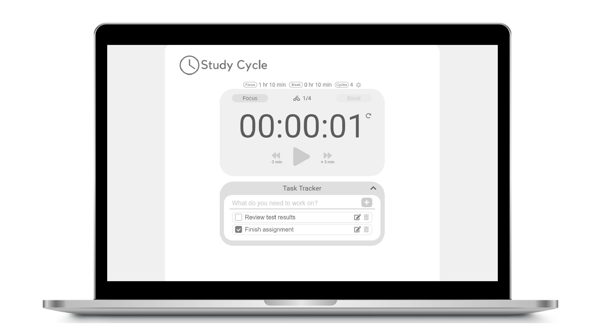

<!--  -->

  

# Study Cycle - Online Study Timer

Study Cycle is a web based online timer which supports customised focus-break time cycles. Boost your productivity with Study Cycle!

  

# Getting Started
Simply [click here](www.study-cycle.com) to open up Study Cycle on your web browser.

# Demo
Here is a short demo GIF for you!

  

**URL: www.study-cycle.com**

# How To Use - Study Cycle Timer
The user interface of Study Cycle focuses on intuitiveness so that no user manual is necessary for the new users. However, here are some basic user manual to be even more clearer!

## Basic Controll
Just like all timers, Study Cycle provides stop and start buttons. Additionally, Study Cycle also provides fast forward, fast backward, and reset button to flexibly controll the timer. 

  

One cycle represents a focus-break time pair. When a cycle is reached, current cycle status will increment. Below numbers next to the cyclist icon represents your current cycle and goal cycles.

<!-- Pictures -->

## Customization
You can customize your Study Cycle by clicking the  icon above the timer box.

  

Customize your focus time, break time, and goal cycles in the settings window and simply click **OK** or hit enter.

# How To Use - Task Tracker
Using our fantastic Task Tracker, you can manage tasks that you need to complete. Simply add new tasks and check/delete whenever you complete a task!

  

## Edit Name
You can click the edit icon to change the name of your tasks.

  

# Responsive UI
Study Cycle is friendly for desktops, laptops, tablets, and mobiles.

## Desktop

  

## Mobile

  

# Built With...
* React.js - The JavaScript framework used
* JavaScript
* Netlify - Serverless deployement

# Author
* Jason Ko - the owner of this repository

# Acknowledgement
* Inspiration from me and my loved freinds who always try to boost our productivity to get our work done
